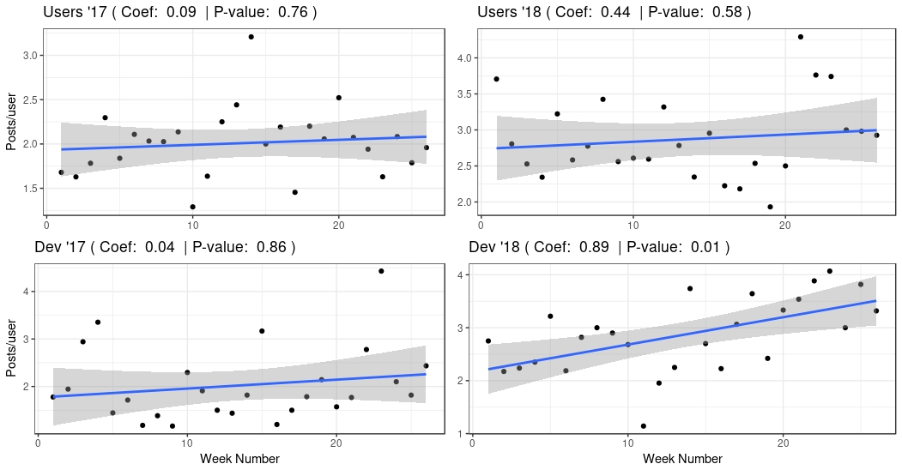

It's been 6 months since the Foreman community switched to Discourse, so I
wanted to revisit some of the graphs I [drew in
November](https://community.theforeman.org/t/feedback-wanted-migrate-mailing-lists-to-a-forum/7571)
(when I was justifying the migration) and see if its had a positive impact.
Spoiler alert! It has :)

<!--more-->

Back in November, I made a big deal about not only how our mailing list was
failing, but also about how a more modern medium could help us achieve our
goals better. Six months in, it seemed appropriate to try and evaluate a few of
those things. We'll take a look at overall post count, active user count, and
the interaction between the two.

## The data

Thanks to importing all the mailing list posts into Discourse, we have
post/topic/user data going right back to the creation of the mailing list some
8 years ago. Discourse itself generates *far* more metrics we could look at,
but since we want to compare to the old lists, we'll have to restrict ourselves
to these.

Since we want to compare like to like, we'll also *only* use the first 6 months
of 2017. Obviously we have *all* of 2017, but there's complications in using it.
Firstly, it's a different time period, so seasonal effects may come into play
(e.g. it's always quieter at Christmas), but more importantly, Discourse trials
begin in November, which would make interpretation very hard. So, we'll use
2017-01-01 to 2017-06-30 (and likewise for 2018).

We do have the data per day, but that causes zero-inflation issues - our
community is always very quiet on Saturdays, and somewhat quiet on Fridays and
Sundays too. To avoid modelling issues with this, we'll aggregate the data by
week - look at this graph to see the difference:

<!-- -->

As you can see, grouping by week makes for a more "normally distributed" data
set, which is better for modelling (yes, I could use a Poisson GLM or something
here, but I don't think it affects the result).

So, we'll have 26 data points per year, one for each week, and both the count
forum posts for that week, and the number of active users for that week (this
isn't a simple sum, but a form of SELECT DISTINCT on all the post authors for
each week).

We can break this down in a few ways - the whole data set, two groups by year,
two groups by list (foreman-users and foreman-dev), or a 2x2 matrix of both.

### Post and user count

Let's start by seeing the raw post count by week for each of the lists. This is
simply the `forum_posts` column, one graph per channel, and with the two year's
data overlaid:

<!-- -->

The lines are a linear fit, the shaded area is the uncertainty in that fit.

We can see that in both cases, the 2017 data shows the mailing lists were not
doing well - dev was growing *slowly* but users was declining. 2018 looks
*much* better! We can also look at this from an averages view:

```
data %>% group_by(year,buffer) %>% summarise(mean_posts_per_day = mean(forum_posts)) %>% kable()
```

<style type="text/css">
table {
	color:#333333;
	border-width: 1px;
	border-color: #666666;
	border-collapse: collapse;
}
table th {
	border-width: 1px;
	padding: 8px;
	border-style: solid;
	border-color: #666666;
	background-color: #dedede;
}
table td {
	border-width: 1px;
	padding: 8px;
	border-style: solid;
	border-color: #666666;
	background-color: #ffffff;
}
</style>
| year|buffer         | mean posts per day |
|----:|:--------------|-------------------:|
| 2017|theforeman     |            8.311111|
| 2018|theforeman     |           17.928177|
| 2017|theforeman-dev |            4.153846|
| 2018|theforeman-dev |            9.213483|


In both cases, the mean posts per day has more than doubled, which is a big
deal, I think. However, there's a catch....

We also talked about attracting a *wider* community as part of our move, so
let's look at this data and include the *number of users* too. You might well
expect to see the number of posts grow if the number of users is growing.
Here's the same plot, but now we'll make the "point size" relative to the
number of active users that week:

<!-- -->

I've just plotted 2018 here, for clarity, but 2017 is similar. So, yes! We do
see a rise in the number of users - this is great news! We wanted to widen the
community, and we seem to be achieving that. We can actually test that, for
foreman-users:

```
t.test(d_18_usr$forum_users, d_17_usr$forum_users, paired = F, var.equal = F)

t = 6.6282, df = 49.737, p-value = 2.344e-08
alternative hypothesis: true difference in means is not equal to 0
95 percent confidence interval:
  5.709454 10.675162
sample estimates:
mean of x mean of y
 21.42308  13.23077
```

The things to focus on here are:
* The averages (means) at the end - 2018 has nearly double the mean number of *post authors*
* The confidence interval for the *difference of means*
  - it doesn't contain 0, so it's very unlikely that this shift is due to chance

We can do the same for the foreman-dev:

```
t.test(d_18_dev$forum_users, d_17_dev$forum_users, paired = F, var.equal = F)


t = 6.6509, df = 44.602, p-value = 3.5e-08
alternative hypothesis: true difference in means is not equal to 0
95 percent confidence interval:
 10.08103 18.84204
sample estimates:
mean of x mean of y
 43.26923  28.80769
```

Same results - large difference in mean, and the confidence interval is even further from zero.

# Accounting for users

So we know the number of users has increased - what does this mean for the
number of posts. Happily, we can use some statistical modelling to account for
that. We'll use a model like this:

```
forum_posts ~ week_num + forum_users
```

So we're saying that posts is some combination of the time (`week_num`) and the
number of authors (`forum_users`), plus some constant. Using this model, we can
try to make a statement about what we would expect the effect of `week_num` to
be *while holding the number of users constant*. Let's try that.

Here's a graph of `forum_posts` divided by `forum_users` for each week - that's
not *quite* the same as the model above, but it gives us a way to view the
data. Over the top I've laid a simple linear fit to that normalized post count;
you can see that for 3 of the graphs, it's pretty much flat:

<!-- -->

However, the Dev 2018 graph is not flat. If we investigate the model more
closely there, we can see an interesting result. Here's the model output:

```
lm(formula = forum_posts ~ week_num + forum_users, data = d_18_dev)

Coefficients:
            Estimate Std. Error t value Pr(>|t|)
(Intercept) -46.3843    10.7805  -4.303 0.000265 ***
week_num      0.8893     0.2915   3.051 0.005674 **
forum_users   4.5491     0.5196   8.755 8.83e-09 ***
```

I've trimmed the output to just the coefficients. What this tells us is that we
expect to see an increase in the number of posts to the Development category
over time, *even while holding the number of users constant*. Specifically, we
expect between 0.3 and 1.5 more posts week-on-week, even if the number of users
doesn't change. That's to a 95% confidence level (i.e. there's a 5% chance I'm
wrong, and this is all by chance).

## Conclusions

There's clear evidence of an increase in posts and number of users since the
move to Discourse. I don't think that's surprising - I've certainly felt the
impact, and I believe others have too. I've spent much more of my time replying
to posts than I used to on the mailing list. However, that the mean number of
posts has more than doubled for both categories is a surprise even to me. In
terms of raw numbers, that's quite a turnaround (and less than 1/1,000,000
chance of it being a freak accident and nothing has really changed).

However, it's the result for the Development category that I really like. One
of the arguments I made for Discourse that seems to resonate with people is
that it would bring better tools for the *developers* to discuss the project
and come to consensus on how to move forward. While this data says nothing
about consensus specifically (we could all be arguing more :P), it does show
that we're all talking to each other *more* as time goes on. Speaking as a
long-time remotee, I like it when I see communication between people
*increasing* :)

Can we attribute this to Discourse? Well, there's an age-old saying that
[correlation does not mean causation](https://www.xkcd.com/552). However,
thanks to [Hill's criteria for causal
relationships](https://www.kdnuggets.com/2017/02/hill-data-scientist-xkcd-story.html),
we can still draw some conclusions. Most applicable is the fact that no other
large event took place in our community that could plausibly cause such a
change, and the mechanism by which Discourse *could* cause a change is also
fairly clear. I'm going to go out on a limb and say these two things are linked
:)

So, six months in and it's looking pretty good. How are *you* finding Discourse?

P.S. If you want to check my working, I'll happily share the code :)
