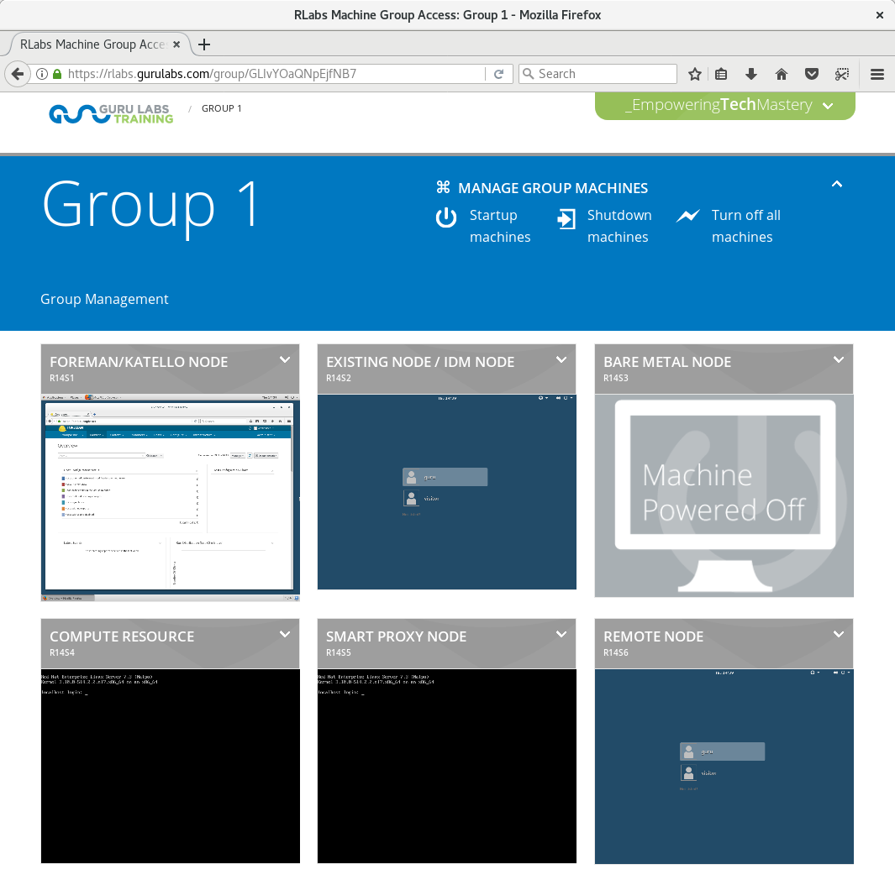
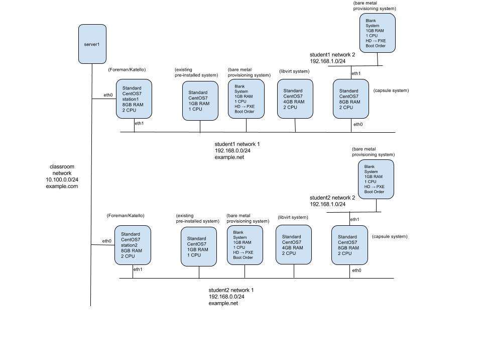

# Foreman training materials

This page lists the materials available for those wishing to study/practice working
with Foreman, as an alternative style to reading the manual.

## Adfinis SyGroup Training Course

This [training][adfinis-slides] by [Adfinis SyGroup][adfinis] gives a basic
overview of Foreman and its concepts. It covers the installation, configuration
and basic components. Beside the instructor slides the course also contains
hands-on exercises and demos.

The content is available on [GitHub][adfinis-github] and any contributions are
more than welcome!

[adfinis]: https://adfinis-sygroup.ch/
[adfinis-slides]: https://docs.adfinis-sygroup.ch/public/trainings/#training-Foreman
[adfinis-github]: https://github.com/adfinis-sygroup/adsy-trainings

## betadots Training Course

The [training][betadots-training] by [betadots][betadots] is designed as a three-day
hands-on training in German language. It covers topics from the initial installation
over content management with Katello, integration of configuration management and
provisioning to plugins including their Hiera data manager and advanced topics.

They provide [courses][betadots-schedule] together with training partners like Linuxhotel in Essen or
Heinlein Academy in Berlin regularly. Also remote trainings are available as direct order.

[betadots]: https://www.betadots.de
[betadots-training]: https://github.com/betadots/foreman-training
[betadots-schedule]: https://www.betadots.de/training

## Guru Labs Training Course

The [GL650 - FOREMAN/KATELLO ADMINISTRATION][GL650] is a 4-day instructor led course that provides comprehensive hands on coverage all the of the major features of a Foreman+Katello deployment starting from best practices in installation and initial configuration, managing subscriptions, products and repositories, content views, lifecycles, activation keys, system registration of existing system, bare metal and virtualization provisioning including discovery, provisioning templates, configuration management with Puppet and Ansible, IdM integration, smart proxies/capsule servers, virt-who, and subscription management.

The class is [regularly scheduled][schedule] and offered on-line, in person, or onsite. Each student gets their own 6 node classroom environment to perform their in-depth lab exercises that mirror real world scenarios.

{:width="45%"} {:width="45%"}

[GL650]: https://gurulabs.com/linux-training/courses/GL650/
[schedule]: https://gurulabs.com/linux-training/schedule/

## NETWAYS Training Course

This course was developed by NETWAYS and made available to the Foreman
community for use in developing training courses of their own, or for community
members to use for self-study. It is designed as a two-day hands-on training
course, and as well as the presentation below, it comes with
[handouts][handouts], [exercises][exercises], and [solutions][solutions].

[handouts]: https://github.com/NETWAYS/foreman-training/releases/download/v1.0/foreman-training-handouts.pdf
[exercises]: https://github.com/NETWAYS/foreman-training/releases/download/v1.0/foreman-training-exercises.pdf
[solutions]: https://github.com/NETWAYS/foreman-training/releases/download/v1.0/foreman-training-solutions.pdf

A full-page version of the presentation can be found at
[netways.github.io/foreman-training/][rendered]

[rendered]: //netways.github.io/foreman-training/static

  

    <iframe width="1024" height="710" frameborder="0" marginwidth="0" marginheight="0" scrolling="no"
            style="border:1px solid #CCC; border-width:1px; margin-bottom:5px; max-width: 100%;"
            src="//netways.github.io/foreman-training/"
            frameBorder="0" allowfullscreen>
    </iframe>
  

The source for this training material, along with handouts and
excercises/solutions can be found on the [NETWAYS GitHub page][source].
Contribution to improve the source material is welcome!

[source]: https://github.com/NETWAYS/foreman-training
